# 🌾 智农直播助手 — 面向三农场景的直播电商AI辅助平台

> **AI-Powered Live Commerce Assistant for Agriculture**  
> 辅助农户把直播"做对、做稳、做规范"

[](LICENSE)
[](https://www.python.org/)
[](https://fastapi.tiangolo.com/)
[](https://playwright.dev/)

---

## 📖 目录

- [项目简介](#-项目简介)
- [平台预览](#-平台预览)
- [核心功能](#-核心功能)
- [系统架构](#-系统架构)
- [快速开始](#-快速开始)
- [AI模型接入配置](#-ai模型接入配置)
- [使用指南](#-使用指南)
- [API文档](#-api文档)
- [项目结构](#-项目结构)
- [技术栈](#-技术栈)
- [常见问题](#-常见问题)
- [贡献指南](#-贡献指南)
- [开源协议](#-开源协议)

---

## 🌱 项目简介

**智农直播助手**是一个面向三农（农业、农村、农民）场景的直播电商AI辅助平台。通过接入抖音直播间，利用多模态大模型对直播画面进行实时分析，为农户主播提供：

- **画面分析**：自动识别直播场景、主播状态、商品展示效果
- **商品识别**：AI识别农产品品类、推测产地、提炼卖点
- **合规检测**：实时检测广告法/食品安全法违规风险
- **直播建议**：基于数据分析给出内容、互动、销售建议
- **评论分析**：采集观众评论，自动筛选待回复问题，生成AI回复建议

> **项目背景**：本项目为第十六届全国大学生电子商务"创新、创意及创业"挑战赛参赛作品。项目开发者：上海财经大学 投资学-信息与计算科学专业 杨皓博

---

## 📸 平台预览

### 连接界面

<p align="center">
  
</p>

### 平台运行全览

<p align="center">
  
</p>

### 直播画面与AI分析

<p align="center">
  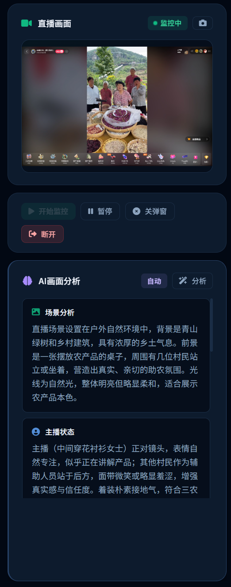
</p>

### 直播建议

| 内容建议 | 互动与销售技巧 |
|---------|-------------|
| 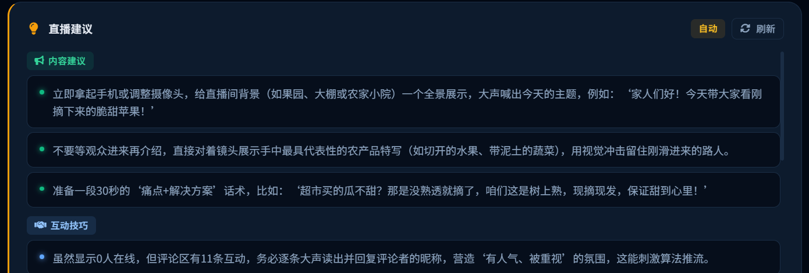 | 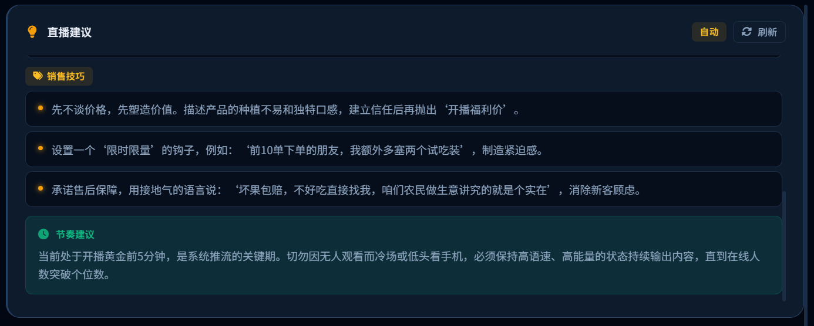 |

### 合规检测

| 画面识别与风险评估 | 违规项详情 |
|---------|-------------|
| 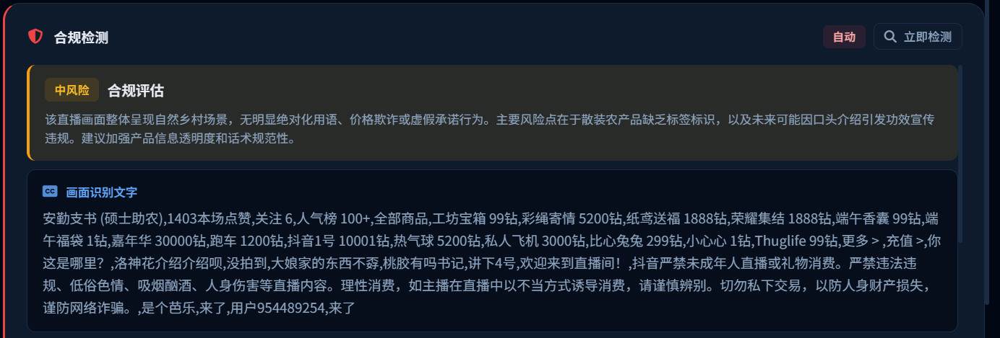 | 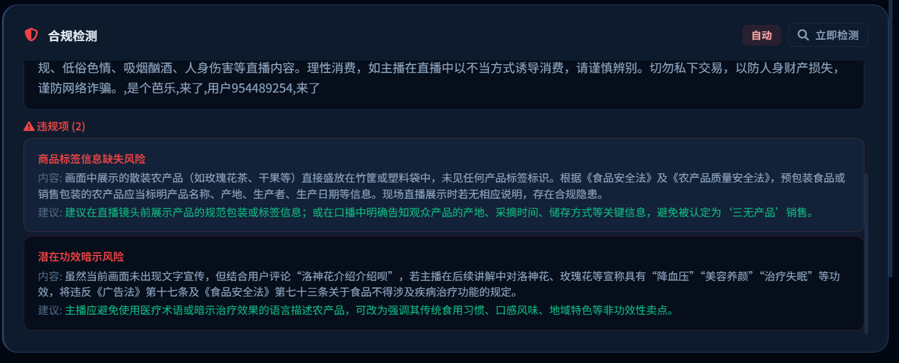 |

### 商品识别

<p align="center">
  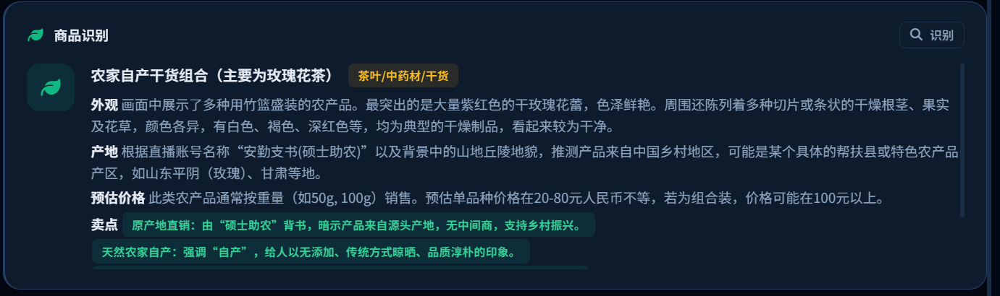
</p>

### 实时评论与AI回复

| 评论采集 | AI推荐回复 | AI评论分析 |
|---------|----------|-----------|
| 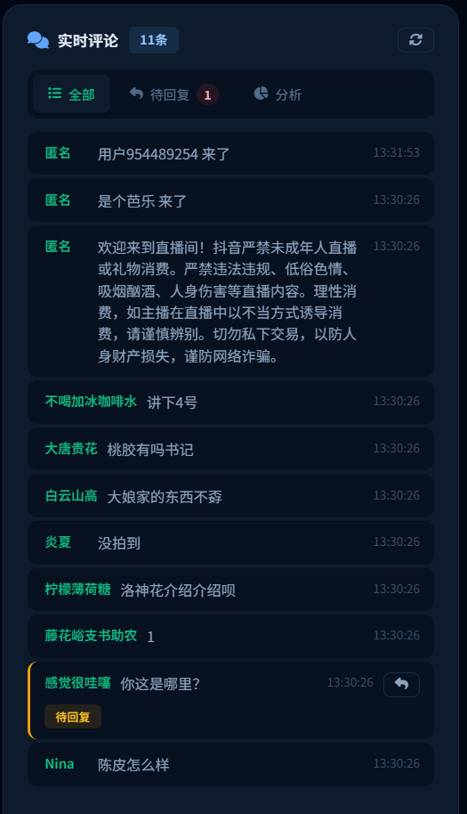 | 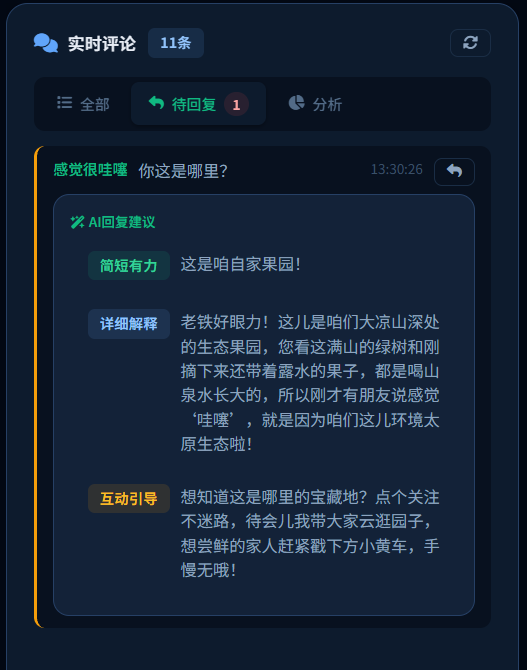 | 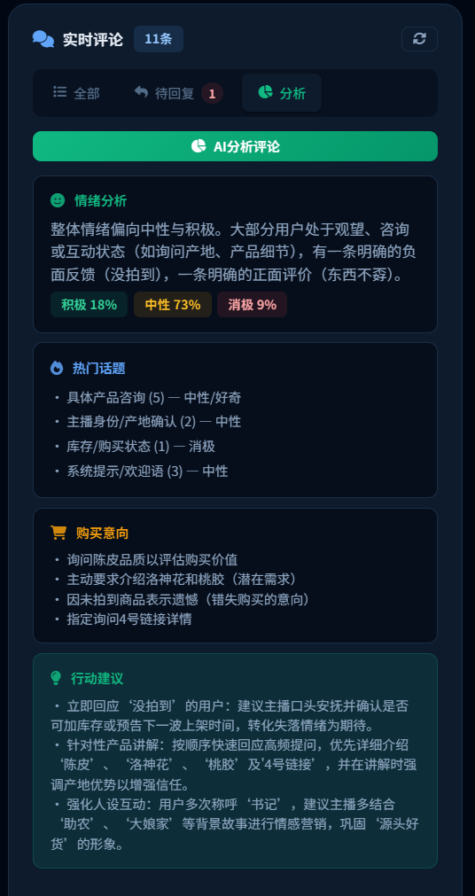 |

### 会话统计与经营画像

| 会话统计 | 农户经营画像 |
|---------|------------|
| 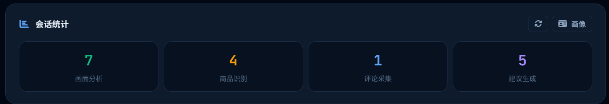 | 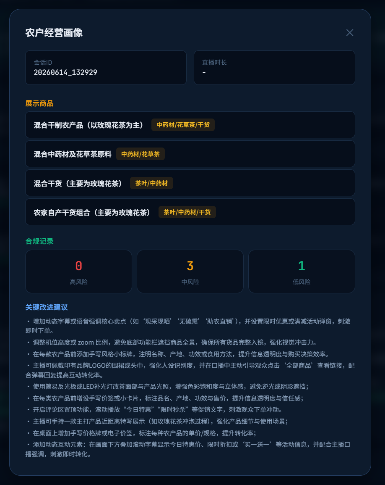 |

---

---

## ✨ 核心功能

| 功能模块 | 说明 | 技术实现 |
|---------|------|---------|
| 🎥 **直播监控** | 接入抖音直播间，定时截图采集 | Playwright 浏览器自动化 |
| 🧠 **AI画面分析** | 多模态理解画面内容、场景、主播状态 | qwen3.5-omni-plus / GPT-4o |
| 🛒 **商品识别** | 识别农产品品类、外观、产地、卖点 | 多模态视觉识别 |
| ⚖️ **合规检测** | 识别《广告法》《食品安全法》违规风险 | 多模态 + 本地词库 |
| 💬 **评论分析** | 实时采集+情绪分析+热门话题提取 | JS注入 + AI文本分析 |
| 📝 **回复建议** | 自动为待回复评论生成3种风格的AI回复 | 大模型内容生成 |
| 💡 **直播建议** | 内容/互动/销售三维度实时建议 | AI数据驱动建议 |
| 📊 **经营画像** | 汇总直播数据，生成农户经营分析报告 | 数据聚合分析 |

---

## 🏗 系统架构

```
┌─────────────────────────────────────────────────────────────────┐
│                        前端 (Browser)                           │
│  ┌──────────┐  ┌──────────────┐  ┌──────────────┐              │
│  │ 直播画面  │  │ 直播建议/合规 │  │ 评论/回复建议 │              │
│  │ + 控制面板 │  │ + 商品识别   │  │ + 评论分析   │              │
│  └──────────┘  └──────────────┘  └──────────────┘              │
│                     ↕ WebSocket + HTTP                          │
└─────────────────────────────────────────────────────────────────┘
                              ↕
┌─────────────────────────────────────────────────────────────────┐
│                     FastAPI 后端 (Python)                        │
│  ┌──────────────────┐  ┌──────────────────────────────────┐    │
│  │   API路由层      │  │   统一调度循环 (每30秒)            │    │
│  │   /api/live/*    │  │   截图→评论→弹窗→AI分析→广播      │    │
│  │   WebSocket /ws  │  └──────────────────────────────────┘    │
│  └──────────────────┘                                          │
│  ┌──────────┐  ┌──────────────┐  ┌────────────┐               │
│  │AI服务    │  │浏览器服务     │  │数据服务     │               │
│  │(OpenAI   │  │(Playwright   │  │(JSON持久化) │               │
│  │兼容接口) │  │同步API+线程池)│  │            │               │
│  └──────────┘  └──────────────┘  └────────────┘               │
└─────────────────────────────────────────────────────────────────┘
         ↕                    ↕
┌────────────────┐   ┌────────────────┐
│ AI大模型        │   │ 抖音直播间     │
│ (阿里云百炼/    │   │ (Playwright    │
│  OpenAI等)     │   │  浏览器控制)    │
└────────────────┘   └────────────────┘
```

### 关键设计决策

| 决策 | 说明 |
|------|------|
| **Playwright同步API + 线程池** | 避免与uvicorn的SelectorEventLoop冲突，所有浏览器操作在线程池中串行执行 |
| **AI调用独立线程池** | 防止长耗时AI调用阻塞事件循环，导致HTTP请求卡死 |
| **Base64截图推送** | 截图通过WebSocket Base64推送，避免前端单独HTTP请求竞争线程池 |
| **全链路超时保护** | 每步操作独立超时（截图20s/AI 90s/评论15s），单步失败不影响后续 |
| **WebSocket指数退避重连** | 前端断连后5s→10s→20s→30s自动重连 |

---

## 🚀 快速开始

### 前置要求

- **Python** 3.9+
- **操作系统**：Windows / macOS / Linux
- **网络**：能够访问抖音直播页面

### 1. 克隆项目

```bash
git clone https://github.com/your-username/agriculture-live-assistant.git
cd agriculture-live-assistant
```

### 2. 安装依赖

```bash
# 安装Python依赖
pip install -r backend/requirements.txt

# 安装Playwright浏览器（Chromium）
python -m playwright install chromium
```

### 3. 配置API Key

```bash
# 复制配置模板
cp .env.example .env

# 编辑 .env 文件，填入你的 API Key
# 详见下方《AI模型接入配置》章节
```

### 4. 启动平台

```bash
cd backend
python main.py
```

### 5. 打开浏览器

访问 **http://localhost:8000**，在连接面板粘贴抖音直播间链接，点击"连接"即可开始使用。

> 💡 **Windows用户**可直接双击 `start.bat` 一键启动。

---

## 🔑 AI模型接入配置

平台支持**三种**AI模型接入方式，按优先级自动选择：

### 方式一：阿里云百炼（推荐国内用户）

[阿里云百炼](https://bailian.console.aliyun.com/) 提供 qwen3.5-omni-plus 等多模态模型，国内访问稳定。

```bash
# .env 文件中设置
DASHSCOPE_API_KEY=sk-your-dashscope-api-key
MODEL_NAME=qwen3.5-omni-plus
```

> 获取Key：登录[百炼控制台](https://bailian.console.aliyun.com/) → 模型广场 → API-KEY管理

### 方式二：OpenAI 官方

使用 GPT-4o 等 OpenAI 模型（需要境外网络环境）。

```bash
# .env 文件中设置
OPENAI_API_KEY=sk-your-openai-api-key
MODEL_NAME=gpt-4o
```

> 获取Key：登录 [OpenAI Platform](https://platform.openai.com/api-keys)

### 方式三：其他兼容接口

支持任何兼容 OpenAI API 格式的服务，包括：

- **本地部署**：Ollama、vLLM、LocalAI 等
- **代理服务**：One API、AI Gateway 等
- **其他云厂商**：DeepSeek、MiniMax、智谱等

```bash
# .env 文件中设置
LLM_API_KEY=your-api-key
LLM_BASE_URL=https://your-endpoint.com/v1
MODEL_NAME=your-model-name
```

### 环境变量完整列表

| 变量名 | 必填 | 默认值 | 说明 |
|--------|------|--------|------|
| `DASHSCOPE_API_KEY` | 三选一 | - | 阿里云百炼 API Key |
| `OPENAI_API_KEY` | 三选一 | - | OpenAI API Key |
| `LLM_API_KEY` | 三选一 | - | 其他兼容接口 Key |
| `MODEL_NAME` | 否 | `qwen3.5-omni-plus` | 模型名称 |
| `PORT` | 否 | `8000` | 服务端口 |
| `DEBUG` | 否 | `true` | 调试模式 |
| `MAX_AI_RETRIES` | 否 | `2` | AI调用重试次数 |
| `MAX_SCREENSHOTS` | 否 | `200` | 最大截图保留数 |

---

## 📘 使用指南

### 连接直播间

1. 复制抖音直播间链接（如 `https://live.douyin.com/xxxxxxxxx`）
2. 在平台连接面板粘贴链接
3. 点击"连接"，平台将自动打开浏览器并加载直播间
4. 点击"开始监控"，AI将定时分析直播内容

### 界面布局

```
┌─────────────┬──────────────────┬─────────────┐
│  左栏 (330px)│   中栏 (自适应)   │ 右栏 (380px) │
│             │                  │             │
│ 📹 直播画面  │ 💡 直播建议       │ 💬 实时评论  │
│ 🎛️ 控制按钮  │ ⚖️ 合规检测       │ 📋 待回复    │
│ 🧠 AI分析    │ 🛒 商品识别       │ 📊 分析     │
│             │ 📊 会话统计       │             │
└─────────────┴──────────────────┴─────────────┘
```

### 功能操作

| 操作 | 方式 |
|------|------|
| 手动截图分析 | 点击左栏"截图"→"分析"按钮 |
| 查看商品信息 | 自动或在右栏点击"识别" |
| 合规检测 | 自动或点击中栏"立即检测" |
| 评论回复 | 在待回复Tab查看AI建议，点击回复 |
| 经营画像 | 点击中栏"画像"按钮 |

---

## 📡 API文档

平台启动后访问 **http://localhost:8000/docs** 查看完整Swagger API文档。

### 核心端点

| 方法 | 端点 | 说明 |
|------|------|------|
| POST | `/api/live/connect` | 连接直播间 |
| POST | `/api/live/disconnect` | 断开连接 |
| POST | `/api/live/start-monitoring` | 启动自动监控 |
| POST | `/api/live/stop-monitoring` | 停止监控 |
| GET | `/api/live/status` | 获取运行状态 |
| POST | `/api/live/analyze-screenshot` | AI画面分析 |
| POST | `/api/live/detect-product` | 商品识别 |
| POST | `/api/live/check-compliance-auto` | 自动合规检测 |
| POST | `/api/live/analyze-comments` | 评论分析 |
| POST | `/api/live/comment-reply-suggestion` | 评论回复建议 |
| POST | `/api/live/suggestions` | 直播建议 |
| GET | `/api/live/business-profile` | 经营画像 |
| WebSocket | `/api/live/ws` | 实时数据推送 |

---

## 📁 项目结构

```
agriculture-live-assistant/
├── .env.example              # 环境变量配置模板
├── .gitignore                # Git忽略规则
├── LICENSE                   # MIT开源协议
├── README.md                 # 项目文档（本文件）
├── start.bat                 # Windows一键启动脚本
│
├── backend/                  # 后端 (FastAPI)
│   ├── main.py               # 应用入口
│   ├── config.py             # 全局配置（环境变量驱动）
│   ├── requirements.txt      # Python依赖清单
│   │
│   ├── routers/
│   │   └── live.py           # API路由 + WebSocket + 自动调度
│   │
│   ├── services/
│   │   ├── ai_service.py     # AI多模态分析（支持多模型接入）
│   │   ├── browser_service.py# Playwright浏览器自动化
│   │   └── data_service.py   # 数据记录与经营画像
│   │
│   └── models/               # 数据模型（预留）
│
├── frontend/
│   └── templates/
│       └── index.html        # 前端SPA（Tailwind CSS + WebSocket）
│
├── data/                     # 运行时数据（自动创建，不提交Git）
└── screenshots/              # 截图存储（自动创建，不提交Git）
```

---

## 🛠 技术栈

| 类别 | 技术 | 说明 |
|------|------|------|
| **后端框架** | FastAPI + Uvicorn | 高性能异步Web框架 |
| **前端** | HTML5 + Tailwind CSS + Vanilla JS | 暗色主题单页面应用 |
| **浏览器自动化** | Playwright (Chromium) | 抖音直播间控制 |
| **AI模型** | qwen3.5-omni-plus / GPT-4o | 多模态大模型 |
| **AI接口** | OpenAI兼容API | 支持多种模型接入 |
| **实时通信** | WebSocket | 低延迟数据推送 |
| **数据存储** | JSON文件持久化 | 轻量级数据管理 |

---

## ❓ 常见问题

<details>
<summary><b>Q: 启动后连接直播间失败？</b></summary>

1. 确保抖音直播间链接正确且直播间正在直播
2. 检查网络连接是否正常
3. 如提示"浏览器启动失败"，重新安装 Playwright：`python -m playwright install chromium`
</details>

<details>
<summary><b>Q: AI分析不工作？</b></summary>

1. 检查 `.env` 文件中是否正确设置了 API Key
2. 查看终端启动日志中的 API Key 警告信息
3. 确认API账户余额充足
4. 检查网络是否能访问对应的API端点
</details>

<details>
<summary><b>Q: 截图是黑屏/白屏？</b></summary>

1. 抖音可能检测到自动化工具，尝试打开 `config.py` 中浏览器参数调整 user-agent
2. 确保 Chromium 版本较新：`python -m playwright install chromium`
3. 尝试在 `browser_service.py` 中将 `headless` 参数设为 `False`
</details>

<details>
<summary><b>Q: 评论采集不到数据？</b></summary>

平台使用JS注入+CSS选择器双重策略采集评论。抖音前端可能更新了选择器，可在 `browser_service.py` 的 `_sync_scrape_comments()` 方法中添加新的选择器。
</details>

---

## 🤝 贡献指南

我们欢迎社区贡献！以下是参与方式：

### 提交 Issue

- 使用 Bug Report 模板报告问题
- 使用 Feature Request 模板提议新功能
- 搜索已有 Issue，避免重复

### 提交 Pull Request

1. Fork 本仓库
2. 创建功能分支：`git checkout -b feature/your-feature`
3. 编写代码并测试
4. 提交代码：`git commit -m "feat: 添加XXX功能"`
5. 推送分支：`git push origin feature/your-feature`
6. 创建 Pull Request

### 代码规范

- Python 代码遵循 PEP 8
- 提交信息遵循 [Conventional Commits](https://www.conventionalcommits.org/) 规范
- 新增功能请同步更新文档

---

## 📄 开源协议

本项目采用 [MIT License](LICENSE) 开源协议。

MIT 协议是最宽松的开源协议之一，允许任何人自由使用、修改、分发本项目的代码，只需保留原始版权声明。

---

## 🙏 致谢

- [阿里云百炼](https://bailian.console.aliyun.com/) - 提供全模态大模型（就是太贵了）
- [Playwright](https://playwright.dev/) - 强大的浏览器自动化框架
- [FastAPI](https://fastapi.tiangolo.com/) - 现代化的Python Web框架
- [Tailwind CSS](https://tailwindcss.com/) - 实用优先的CSS框架

---

<p align="center">
  <b>Made with 🌾 by 杨皓博</b><br>
  <sub>第十六届全国大学生电子商务"创新、创意及创业"挑战赛</sub>
</p>

